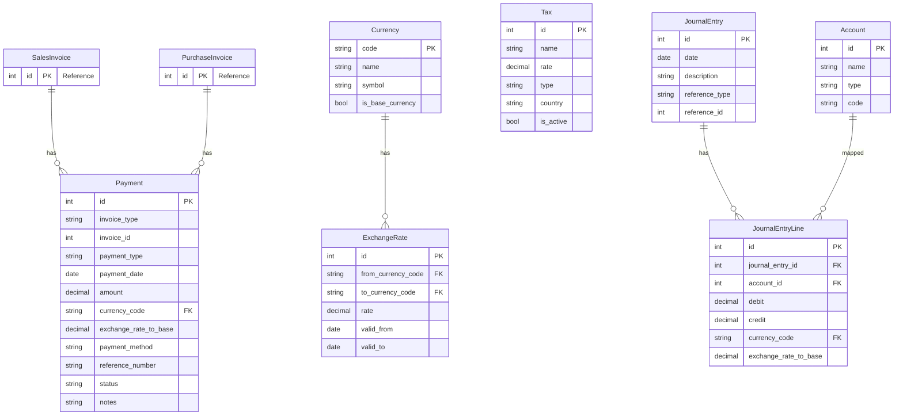

```mermaid
erDiagram
	direction TB

	SalesInvoice {
		int id PK "Reference"
	}
	PurchaseInvoice {
		int id PK "Reference"
	}

	Currency {
		string code PK ""  
		string name  ""  
		string symbol  ""  
		bool is_base_currency  ""  
	}

	ExchangeRate {
		int id PK ""  
		string from_currency_code FK ""  
		string to_currency_code FK ""  
		decimal rate  ""  
		date valid_from  ""  
		date valid_to  ""  
	}

	Payment {
		int id PK ""  
		string invoice_type  ""  
		int invoice_id  ""  
		string payment_type  ""  
		date payment_date  ""  
		decimal amount  ""  
		string currency_code FK ""  
		decimal exchange_rate_to_base  ""  
		string payment_method  ""  
		string reference_number  ""  
		string status  ""  
		string notes  ""  
	}

	Tax {
		int id PK ""  
		string name  ""  
		decimal rate  ""  
		string type  ""  
		string country  ""  
		bool is_active  ""  
	}

	Account {
		int id PK ""  
		string name  ""  
		string type  ""  
		string code  ""  
	}

	JournalEntry {
		int id PK ""  
		date date  ""  
		string description  ""  
		string reference_type  ""  
		int reference_id  ""  
	}

	JournalEntryLine {
		int id PK ""  
		int journal_entry_id FK ""  
		int account_id FK ""  
		decimal debit  ""  
		decimal credit  ""  
		string currency_code FK ""  
		decimal exchange_rate_to_base  ""  
	}

	Currency||--o{ExchangeRate:"has"
	SalesInvoice||--o{Payment:"has"
	PurchaseInvoice||--o{Payment:"has"
	JournalEntry||--o{JournalEntryLine:"has"
	Account||--o{JournalEntryLine:"mapped"
```
