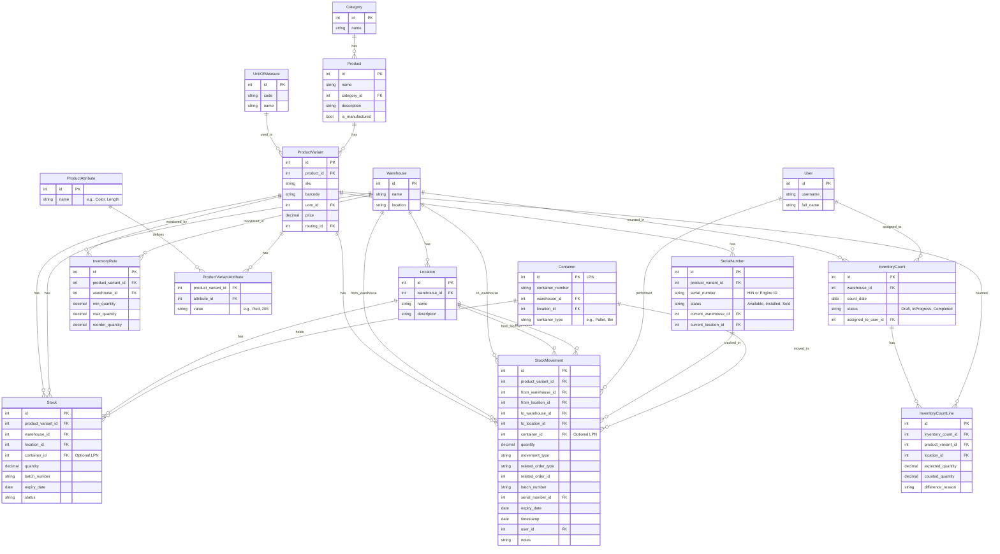

```mermaid
erDiagram
	direction TB

	UnitOfMeasure {
		int id PK ""
		string code ""
		string name ""
	}

	Category {
		int id PK ""  
		string name  ""  
	}

	Product {
		int id PK ""  
		string name  ""  
		int category_id FK ""  
		string description  ""  
		bool is_manufactured  ""  
	}

	ProductVariant {
		int id PK ""  
		int product_id FK ""  
		string sku  ""  
		string barcode  ""  
		int uom_id FK ""  
		decimal price  ""  
		int routing_id FK ""
	}

	Warehouse {
		int id PK ""  
		string name  ""  
		string location  ""  
	}

	Location {
		int id PK ""  
		int warehouse_id FK ""  
		string name  ""  
		string description  ""  
	}

	Stock {
		int id PK ""  
		int product_variant_id FK ""  
		int warehouse_id FK ""  
		int location_id FK ""  
		int container_id FK "Optional LPN"
		decimal quantity  ""  
		string batch_number  ""  
		date expiry_date  ""  
		string status "" 
	}

	SerialNumber {
		int id PK ""
		int product_variant_id FK ""
		string serial_number "HIN or Engine ID"
		string status "Available, Installed, Sold"
		int current_warehouse_id FK ""
		int current_location_id FK ""
	}

	InventoryRule {
		int id PK ""
		int product_variant_id FK ""
		int warehouse_id FK ""
		decimal min_quantity ""
		decimal max_quantity ""
		decimal reorder_quantity ""
	}

	StockMovement {
		int id PK ""  
		int product_variant_id FK ""  
		int from_warehouse_id FK ""  
		int from_location_id FK ""  
		int to_warehouse_id FK ""  
		int to_location_id FK ""  
		int container_id FK "Optional LPN"
		decimal quantity  ""  
		string movement_type  ""  
		string related_order_type ""
		int related_order_id  ""  
		string batch_number  ""  
		int serial_number_id FK ""
		date expiry_date  ""  
		date timestamp  ""  
		int user_id FK ""  
		string notes  ""  
	}

	User {
		int id PK ""  
		string username  ""  
		string full_name  ""  
	}

	ProductAttribute {
		int id PK ""
		string name "e.g., Color, Length"
	}

	ProductVariantAttribute {
		int product_variant_id FK ""
		int attribute_id FK ""
		string value "e.g., Red, 20ft"
	}

	Container {
		int id PK "LPN"
		string container_number ""
		int warehouse_id FK ""
		int location_id FK ""
		string container_type "e.g., Pallet, Bin"
	}

	InventoryCount {
		int id PK ""
		int warehouse_id FK ""
		date count_date ""
		string status "Draft, InProgress, Completed"
		int assigned_to_user_id FK ""
	}

	InventoryCountLine {
		int id PK ""
		int inventory_count_id FK ""
		int product_variant_id FK ""
		int location_id FK ""
		decimal expected_quantity ""
		decimal counted_quantity ""
		string difference_reason ""
	}

	UnitOfMeasure||--o{ProductVariant:"used_in"
	Category||--o{Product:"has"
	Product||--o{ProductVariant:"has"
	Warehouse||--o{Location:"has"
	ProductVariant||--o{Stock:"has"
	Warehouse||--o{Stock:"has"
	Location||--o{Stock:"has"
	ProductVariant||--o{StockMovement:"has"
	Warehouse||--o{StockMovement:"from_warehouse"
	Warehouse||--o{StockMovement:"to_warehouse"
	Location||--o{StockMovement:"from_location"
	Location||--o{StockMovement:"to_location"
	User||--o{StockMovement:"performed"
	ProductVariant||--o{SerialNumber:"has"
	SerialNumber||--o{StockMovement:"tracked_in"
	ProductVariant||--o{InventoryRule:"monitored_by"
	Warehouse||--o{InventoryRule:"monitored_in"
	ProductAttribute||--o{ProductVariantAttribute:"defines"
	ProductVariant||--o{ProductVariantAttribute:"has"
	Container||--o{Stock:"holds"
	Container||--o{StockMovement:"moved_in"
	Warehouse||--o{InventoryCount:"counted_in"
	InventoryCount||--o{InventoryCountLine:"has"
	ProductVariant||--o{InventoryCountLine:"counted"
	User||--o{InventoryCount:"assigned_to"
```
