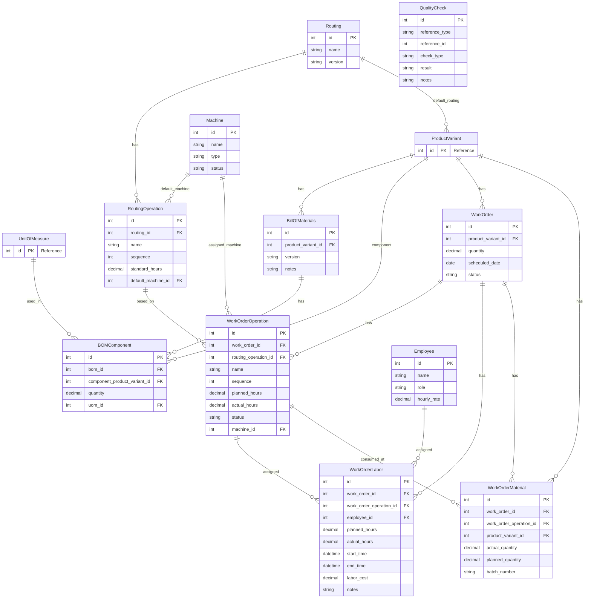

```mermaid
erDiagram
	direction TB
	
	ProductVariant {
		int id PK "Reference"
	}
	UnitOfMeasure {
		int id PK "Reference"
	}

	BillOfMaterials {
		int id PK ""  
		int product_variant_id FK ""  
		string version  ""  
		string notes  ""  
	}

	BOMComponent {
		int id PK ""  
		int bom_id FK ""  
		int component_product_variant_id FK ""  
		decimal quantity  ""  
		int uom_id FK ""  
	}

	Routing {
		int id PK ""
		string name ""
		string version ""
	}

	RoutingOperation {
		int id PK ""
		int routing_id FK ""
		string name ""
		int sequence ""
		decimal standard_hours ""
		int default_machine_id FK ""
	}

	Machine {
		int id PK ""
		string name ""
		string type ""
		string status ""
	}

	WorkOrder {
		int id PK ""  
		int product_variant_id FK ""  
		decimal quantity  ""  
		date scheduled_date  ""  
		string status  ""  
	}

	WorkOrderOperation {
		int id PK ""  
		int work_order_id FK ""  
		int routing_operation_id FK ""
		string name  ""  
		int sequence  ""  
		decimal planned_hours  ""  
		decimal actual_hours  ""  
		string status  ""  
		int machine_id FK ""
	}

	Employee {
		int id PK ""  
		string name  ""  
		string role  ""  
		decimal hourly_rate  ""  
	}

	WorkOrderLabor {
		int id PK ""  
		int work_order_id FK ""  
		int work_order_operation_id FK ""  
		int employee_id FK ""  
		decimal planned_hours  ""  
		decimal actual_hours  ""  
		datetime start_time  ""  
		datetime end_time  ""  
		decimal labor_cost  ""  
		string notes  ""  
	}

	WorkOrderMaterial {
		int id PK ""  
		int work_order_id FK ""  
		int work_order_operation_id FK ""
		int product_variant_id FK ""  
		decimal actual_quantity  ""  
		decimal planned_quantity ""
		string batch_number  ""  
	}

	QualityCheck {
		int id PK ""  
		string reference_type ""
		int reference_id ""
		string check_type  ""  
		string result  ""  
		string notes  ""  
	}

	UnitOfMeasure||--o{BOMComponent:"used_in"
	Routing||--o{RoutingOperation:"has"
	Routing||--o{ProductVariant:"default_routing"
	Machine||--o{RoutingOperation:"default_machine"
	Machine||--o{WorkOrderOperation:"assigned_machine"
	ProductVariant||--o{BillOfMaterials:"has"
	BillOfMaterials||--o{BOMComponent:"has"
	ProductVariant||--o{BOMComponent:"component"
	ProductVariant||--o{WorkOrder:"has"
	WorkOrder||--o{WorkOrderOperation:"has"
	RoutingOperation||--o{WorkOrderOperation:"based_on"
	WorkOrderOperation||--o{WorkOrderLabor:"assigned"
	Employee||--o{WorkOrderLabor:"assigned"
	WorkOrder||--o{WorkOrderLabor:"has"
	WorkOrder||--o{WorkOrderMaterial:"has"
	WorkOrderOperation||--o{WorkOrderMaterial:"consumed_at"
	ProductVariant||--o{WorkOrderMaterial:"has"
```
