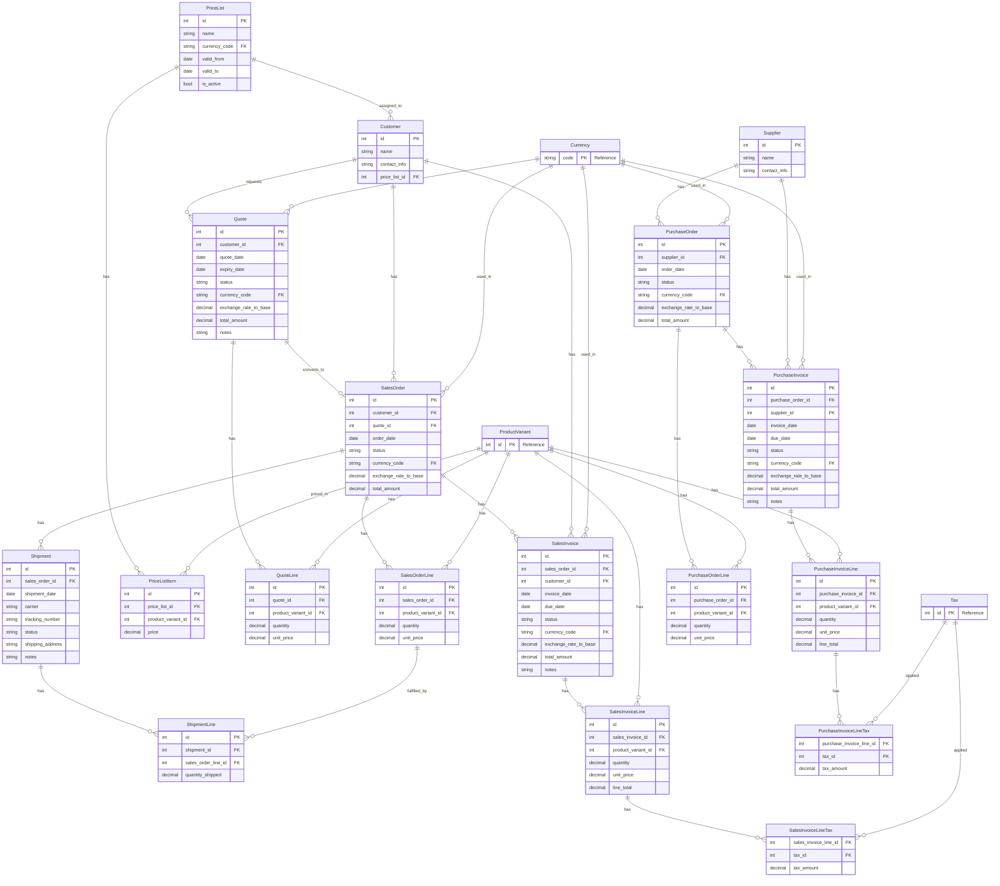

```mermaid
erDiagram
	direction TB

	ProductVariant {
		int id PK "Reference"
	}
	Currency {
		string code PK "Reference"
	}
	Tax {
		int id PK "Reference"
	}

	Customer {
		int id PK ""  
		string name  ""  
		string contact_info  ""  
		int price_list_id FK ""
	}

	PriceList {
		int id PK ""
		string name ""
		string currency_code FK ""
		date valid_from ""
		date valid_to ""
		bool is_active ""
	}

	PriceListItem {
		int id PK ""
		int price_list_id FK ""
		int product_variant_id FK ""
		decimal price ""
	}

	Quote {
		int id PK ""  
		int customer_id FK ""  
		date quote_date  ""  
		date expiry_date  ""  
		string status  ""  
		string currency_code FK ""  
		decimal exchange_rate_to_base  ""  
		decimal total_amount  ""  
		string notes  ""  
	}

	QuoteLine {
		int id PK ""  
		int quote_id FK ""  
		int product_variant_id FK ""  
		decimal quantity  ""  
		decimal unit_price  ""  
	}

	SalesOrder {
		int id PK ""  
		int customer_id FK ""  
		int quote_id FK ""  
		date order_date  ""  
		string status  ""  
		string currency_code FK ""  
		decimal exchange_rate_to_base  ""  
		decimal total_amount  ""  
	}

	SalesOrderLine {
		int id PK ""  
		int sales_order_id FK ""  
		int product_variant_id FK ""  
		decimal quantity  ""  
		decimal unit_price  ""  
	}

	Shipment {
		int id PK ""
		int sales_order_id FK ""
		date shipment_date ""
		string carrier ""
		string tracking_number ""
		string status ""
		string shipping_address ""
		string notes ""
	}

	ShipmentLine {
		int id PK ""
		int shipment_id FK ""
		int sales_order_line_id FK ""
		decimal quantity_shipped ""
	}
	
	SalesInvoice {
		int id PK ""  
		int sales_order_id FK ""  
		int customer_id FK ""  
		date invoice_date  ""  
		date due_date  ""  
		string status  ""  
		string currency_code FK ""  
		decimal exchange_rate_to_base  ""  
		decimal total_amount  ""  
		string notes  ""  
	}

	SalesInvoiceLine {
		int id PK ""  
		int sales_invoice_id FK ""  
		int product_variant_id FK ""  
		decimal quantity  ""  
		decimal unit_price  ""  
		decimal line_total  ""  
	}

	SalesInvoiceLineTax {
		int sales_invoice_line_id FK ""
		int tax_id FK ""
		decimal tax_amount ""
	}

	Supplier {
		int id PK ""  
		string name  ""  
		string contact_info  ""  
	}

	PurchaseOrder {
		int id PK ""  
		int supplier_id FK ""  
		date order_date  ""  
		string status  ""  
		string currency_code FK ""  
		decimal exchange_rate_to_base  ""  
		decimal total_amount  ""  
	}

	PurchaseOrderLine {
		int id PK ""  
		int purchase_order_id FK ""  
		int product_variant_id FK ""  
		decimal quantity  ""  
		decimal unit_price  ""  
	}

	PurchaseInvoice {
		int id PK ""  
		int purchase_order_id FK ""  
		int supplier_id FK ""  
		date invoice_date  ""  
		date due_date  ""  
		string status  ""  
		string currency_code FK ""  
		decimal exchange_rate_to_base  ""  
		decimal total_amount  ""  
		string notes  ""  
	}

	PurchaseInvoiceLine {
		int id PK ""  
		int purchase_invoice_id FK ""  
		int product_variant_id FK ""  
		decimal quantity  ""  
		decimal unit_price  ""  
		decimal line_total  ""  
	}

	PurchaseInvoiceLineTax {
		int purchase_invoice_line_id FK ""
		int tax_id FK ""
		decimal tax_amount ""
	}

	PriceList||--o{PriceListItem:"has"
	PriceList||--o{Customer:"assigned_to"
	ProductVariant||--o{PriceListItem:"priced_in"

	Customer||--o{Quote:"requests"
	Quote||--o{QuoteLine:"has"
	ProductVariant||--o{QuoteLine:"has"
	Quote||--o|SalesOrder:"converts_to"
	Currency||--o{Quote:"used_in"

	Customer||--o{SalesOrder:"has"
	SalesOrder||--o{SalesOrderLine:"has"
	ProductVariant||--o{SalesOrderLine:"has"

	SalesOrder||--o{Shipment:"has"
	Shipment||--o{ShipmentLine:"has"
	SalesOrderLine||--o{ShipmentLine:"fulfilled_by"

	SalesOrder||--o{SalesInvoice:"has"
	Customer||--o{SalesInvoice:"has"
	SalesInvoice||--o{SalesInvoiceLine:"has"
	ProductVariant||--o{SalesInvoiceLine:"has"
	SalesInvoiceLine||--o{SalesInvoiceLineTax:"has"
	Tax||--o{SalesInvoiceLineTax:"applied"
	Currency||--o{SalesOrder:"used_in"
	Currency||--o{SalesInvoice:"used_in"

	Supplier||--o{PurchaseOrder:"has"
	PurchaseOrder||--o{PurchaseOrderLine:"has"
	ProductVariant||--o{PurchaseOrderLine:"has"
	PurchaseOrder||--o{PurchaseInvoice:"has"
	Supplier||--o{PurchaseInvoice:"has"
	PurchaseInvoice||--o{PurchaseInvoiceLine:"has"
	ProductVariant||--o{PurchaseInvoiceLine:"has"
	PurchaseInvoiceLine||--o{PurchaseInvoiceLineTax:"has"
	Tax||--o{PurchaseInvoiceLineTax:"applied"
	Currency||--o{PurchaseOrder:"used_in"
	Currency||--o{PurchaseInvoice:"used_in"
```
